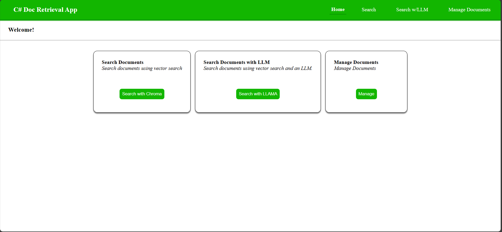
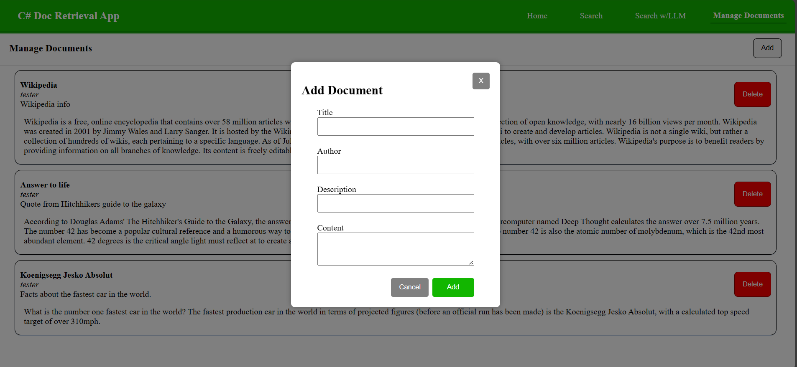
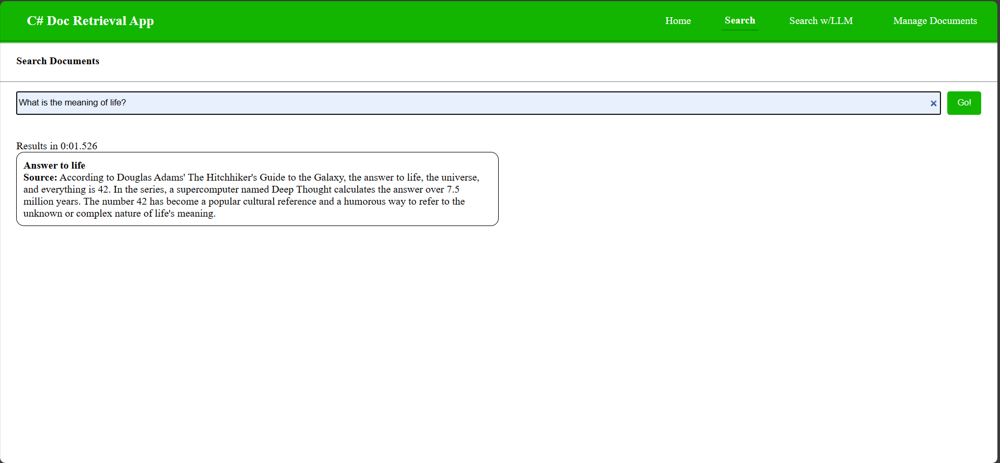
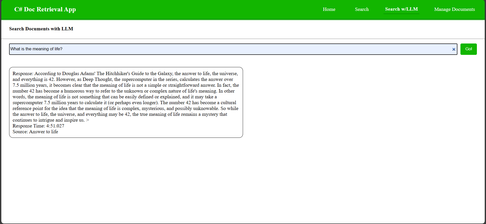

# React GPT test app
React/ASP Net 8 App for Retrieval-Augemented Generation on local hardware (no apis).
Uses C\# for embedding generation via [AllMiniLML6v2Sharp](https://github.com/ksanman/AllMiniLML6v2Sharp), LLAMA-2-Chat-7b via [LLamaSharp](https://github.com/SciSharp/LLamaSharp), and connection to a [ChromaDB](https://www.trychroma.com/) with [ChromaDBSharp](https://github.com/ksanman/ChromaDBSharp) all running on the local machine.

This app is for demo purposes only, and not for production use.

## How to run.
- Start a hosted version of chromadb. Follow instructions [here](https://docs.trychroma.com/deployment). I recommend using the docker build for an easy solution.

- Download the All-Mini-LM-L6-v2 .onnx and .vocab from [here](https://huggingface.co/optimum/all-MiniLM-L6-v2)

- Download the .gguf LLAMA weights. For example [LLama 2 Chat 7b](https://huggingface.co/TheBloke/Llama-2-7B-Chat-GGUF)

- Update `appsettings.json` to point to models/chromadb
```json
{
    "AppSettings": {
        "ChromaDbUrl": "http://chroma-endpoint",
        "ChromaDocumentCollection": "chroma-collection-name",
        "Separators": [ "\n\n", "\n", " ", "" ],
        "AllMiniV2Vocab": "path/to/vocab.txt",
        "AllMiniV2Model": "path/to/model.onnx",
        "ChatModelPath": "path/to/weights.gguf"
    }
}
```
- Run the app. `dotnet build` then `dotnet run` or run with visual studio.



- Add some documents. (Currently only supports pasting text.)



- Find answers via Vector Search.



- Find answers via LLM


